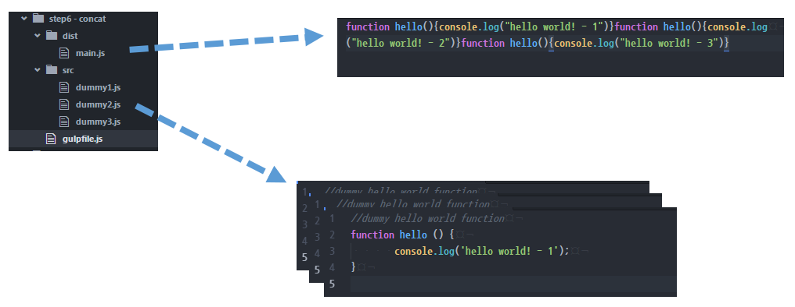

## STEP 6. 파일병합

앞서 gulp-uglify 플러그인을 사용해서 JavaScript 파일을 Minify할 수 있게 되었지만, 일반적으로 운영환경에서는 이렇게 Minify된 파일들을 병합해서 하나의 파일로 만들어서 배포하게 됩니다. 이런 기능을 제공해주는 대표적인 플러그인은 gulp-concat 입니다. gulp-concat 플러그인은 JavaScript 병합 뿐만 아니라 CSS 파일의 병합도 할 수 있고 CSS 파일 내의 @import 도 인식해서 최적화된 형태로 병합해줍니다. gulp-sourcemaps 플러그인과도 함께 사용할 수 있기 때문에 상당히 유용하게 사용할 수 있는 플러그인입니다.

먼저 npm 을 사용해서 gulp-concat 플러그인을 설치해줍니다.

```bash
$ npm install gulp-concat --save-dev
```

gulp-concat 플러그인은 독립적으로 사용할수도 있지만, gulp-uglify가 진행되는 과정 중에 추가적으로 수행하는 것이 일반적입니다.


```javascript
var gulp = require('gulp');
var uglify = require('gulp-uglify');
var concat = require('gulp-concat');

//자바스크립트 파일을 minify
gulp.task('uglify', function () {
	return gulp.src('src/*.js') //src 폴더 아래의 모든 js 파일을
		.pipe(concat('main.js')) //main.js 라는 파일명로 모두 병합한 뒤에,
		.pipe(uglify()) //minify 해서
		.pipe(gulp.dest('dist')); //dist 폴더에 저장
});

// 파일 변경 감지
gulp.task('watch', function () {
	gulp.watch('src/*.js', ['uglify']);
});

//gulp를 실행하면 default 로 uglify, watch task를 실행
gulp.task('default', ['uglify', 'watch']);
```

앞의 예제와 다른 부분은 src 메서드로 가져온 파일들을 파이프로 연결해서 concat 플러그인으로 던지는 부분이 한 줄 추가된 것 뿐입니다.


```javascript
.pipe(concat('main.js'))
```

여기에서는 `main.js` 라는 파일명으로 했지만, 좀더 일반적으로는 `main.min.js` 와 같이 minify된 파일이라는 의미에서 min 도 붙여줄 것입니다.


default task 로 uglify 를 지정했기 때문에 아래와 같이 gulp 라고만 입력해도 uglify task가 실행되게 됩니다.

```bash
$ gulp
```

gulp-concat 플러그인을 사용하면 앞의 예제들과는 달리 결과물이 하나의 파일로 저장되게 되는 것을 볼 수 있습니다.



이렇게 하나의 task 에서 하나의 플러그인만 사용하지 않고, 여러 개의 플러그인들을 조합해서 원하는 빌드 결과를 만드는 것은 gulp 를 사용할 때 흔하게 발견되는 자연스러운 패턴이고 또 플러그인들이 만드는 다양한 조합이 gulp 의 진짜 매력입니다.
